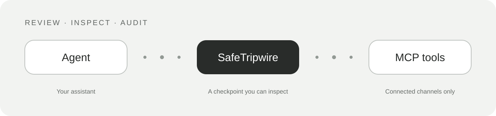
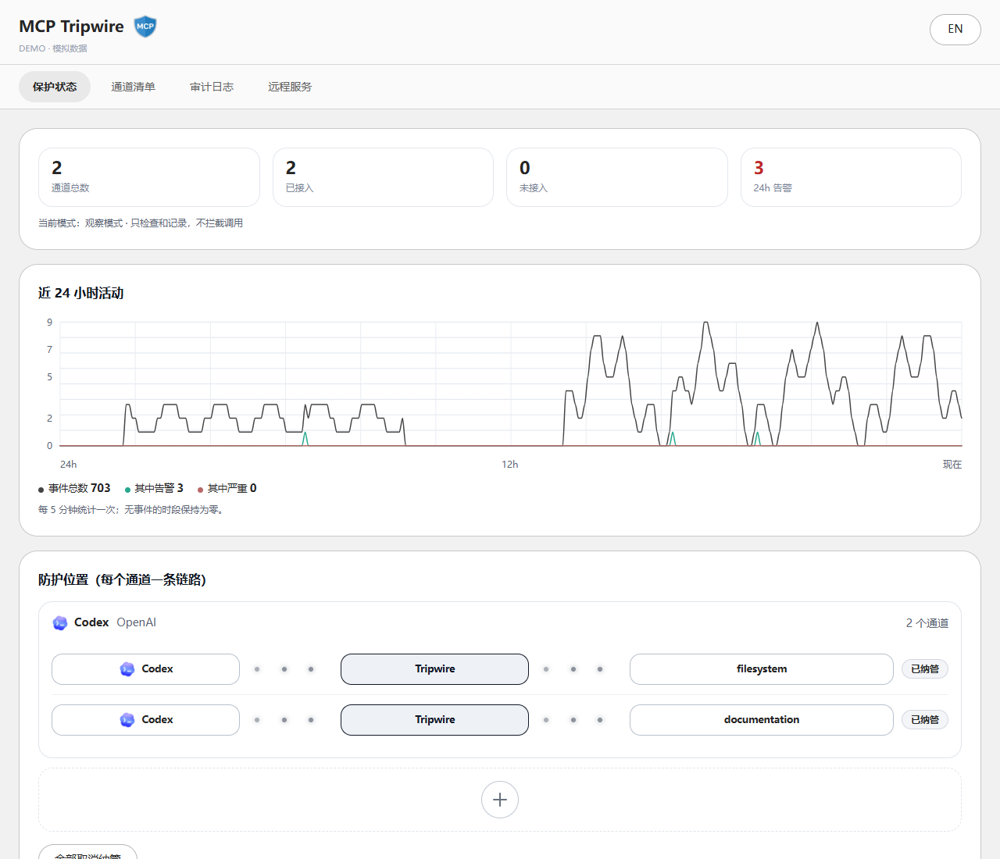
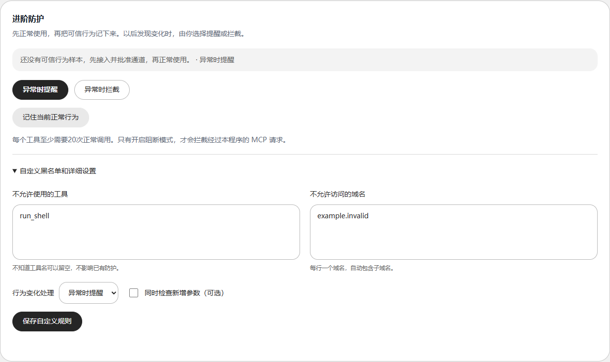

<p align="center">
  
</p>

<div align="center">

# MCP Tripwire

**让 Agent 继续工作，让 MCP 多一道检查。**

An inspectable security broker between your Agent and its MCP tools.


[快速上手](#快速上手) · [保护什么](#保护什么) · [能力边界](#能力边界) · [开发与测试](#开发与测试) · [路线图](#路线图)

[**下载 Windows 初版**](https://github.com/luke0485/mcp-tripwire/releases/tag/initial) · [查看构建状态](https://github.com/luke0485/mcp-tripwire/actions)
</div>



Agent 能调用工具，也可能遇到被替换的工具清单、可疑的工具描述或不该出现的调用参数。Tripwire 在 **已接入的 MCP 通道**中加入检查与审计，让你先看清变化，再决定是否阻断。

当前发布定位是 **Windows 预览版**，不是经过独立审计的企业安全产品。Mac 和 Linux 版本将在后续推进。

## 看得见的保护



*界面演示采用模拟数据，不代表本机流量或实际拦截统计。每个 MCP 一条通道；同一 Agent 的多个 MCP 会显示在同一组中。*



*先观察、再确认可信行为；普通用户可从默认选项开始，自定义工具和域名黑名单按需展开。*

## 保护什么

| 能力 | 你能得到什么 |
| --- | --- |
| 工具清单指纹 | 核对并批准工具清单；后续变化会被发现，在阻断模式下拒绝相关调用 |
| 静态规则检查 | 检查工具描述与调用载荷中的已知可疑模式，不依赖额外 LLM API |
| 工具 / 域名黑名单 | 检查工具名和参数里的域名引用，匹配域名时包含其子域名 |
| 行为基线 | 记录放行调用；每个工具至少 20 次样本后，人工确认冻结正常行为，可提醒或阻断新地址引用及可选的新字段 |
| 审计与状态 | 中英文简要说明、活动趋势、通道状态、哈希链一致性检查 |
| 本机与 HTTP MCP | stdio 与支持的 HTTP / SSE 路由共用检查器 |
| Windows 托盘 | 关闭界面仍在后台运行；从托盘“退出”才结束后台服务 |

Agent 目录包含 **57 个条目（56 个产品及自定义入口）**，其中 **30 个配置适配器**支持默认位置的配置读取。目录收录、图标适配和配置读取不等于对每个产品做过真实安装与完整兼容性认证。详见 [Agent 覆盖说明](docs/AGENT-COVERAGE.md)。

## 快速上手

1. 在本仓库 **Releases** 下载 `MCP-Tripwire-windows-x64.zip`。如果尚无 Release，请先按下方步骤从源码运行。
2. 完整解压到固定文件夹，双击 `Start MCP Tripwire.cmd`。无需另外安装 Node.js。
3. 点击添加，选择 Agent，检查识别到的 MCP 通道，再接入需要保护的通道。自动改写配置前会保留备份。
4. 重启对应 Agent，让配置生效；核对工具清单并批准可信通道。
5. 先使用 **观察模式**了解正常调用，随后按需要启用 **阻断模式**。

**注意：看到 Agent 图标不代表已经受到保护。** 只有经过 Tripwire 的 MCP 请求才会检查；观察模式通常只记录、不拒绝请求，显式拒绝策略另有优先级。行为基线应从可信操作中学习，不能盲目批准未知调用。

配置路径不在默认位置时，可手动指定配置文件。无法自动读配置的产品，只有在其支持自定义 MCP 时才能手动接入；“设置 HTTP MCP 中转”会进入远程服务页面，不会自动赋予不支持 MCP 的产品相关能力。

Windows 构建目前没有付费 Authenticode 签名，系统可能提示“未知发布者”。校验下载文件并评估来源，**不要关闭杀毒软件或系统安全防护**。发行包提供 `SHA256SUMS.txt`；摘要用于一致性校验，不能单独证明发布者身份。

## 能力边界

- 保护范围是经过代理的 MCP。Agent 内置工具、绕过代理的连接、直接网络请求和系统操作不在覆盖范围内。
- 域名检查针对参数中的引用，不是系统网络防火墙，也不能证明真实联网行为。
- 静态规则与基线可能误报或漏报；当前没有代表真实用户的标注数据集，不公布检测准确率。
- 进阶规则和 HTTP 路由有本机 HMAC 校验，但密钥同账户保存；不能抵御控制该账户的攻击者。工具指纹和全局模式存储还需要继续加固。
- 审计哈希链能发现不一致，不能防止有写权限的人替换整条链。日志有有限保留窗口，写入故障可能导致记录缺失。
- HTTP 请求和缓冲 JSON 响应上限为 8 MiB；流式 SSE、会话资源限制及 OAuth / mTLS 等组合仍需进一步验证。

完整说明见 [安全政策](SECURITY.md)、[安全基线检查](docs/SECURITY-BASELINE.md) 和 [检测限制](docs/DETECTION-LIMITS.md)。

## 开发与测试

建议使用 Node.js 24 和 Windows PowerShell。

```powershell
npm ci
npm test
npm run doctor
node src/cli.js console
```

当前 **232 项自动化测试通过**，覆盖规则判断、黑名单、基线、配置适配、管理接口、审计并发、stdio 与模拟 HTTP 服务。测试使用临时目录和模拟服务；没有对用户真实 MCP 执行危险攻击。测试通过不代表所有 Agent 实机认证或生产环境零误报。

本次生产依赖检查 `npm audit --omit=dev` 为 0 个已知漏洞；仅表示检查时依赖数据库的结果。

构建可下载的 Windows 包：

```powershell
./tools/build.ps1 -SkipInstall
./tools/package-release.ps1
```

当前以“初版 / Initial preview”发布。推送 `initial` 标签后，Windows 发布工作流会测试、构建、生成校验摘要和构建证明，通过后发布预览发行包。后续发布流程见 [发布说明](docs/RELEASING.md)。

## 路线图

| 阶段 | 计划 |
| --- | --- |
| 现在 | 固定 Windows 版本，完善交互、安装恢复、资源限制和安全边界 |
| 后续 | 推进 **Mac 版本**：配置发现、托盘生命周期、打包与平台验证 |
| 后续 | 推进 **Linux 版本**：目录差异、桌面 / 托盘环境和发行包适配 |
| 稳定版前 | 更多真实客户端兼容性验证、可复现安全回归、独立安全审计 |

Mac 和 Linux 当前未提供正式发行包，暂无承诺日期。欢迎提交不含私密数据的兼容性反馈；漏洞请遵循 [SECURITY.md](SECURITY.md)。

## English

MCP Tripwire is a Windows-first, LLM-free security broker for MCP traffic explicitly routed through it. It combines reviewed manifest fingerprints, static rules, tool/domain blacklists, manually frozen behaviour baselines and local audit logging. Observe first, review trusted channels, then enable blocking when appropriate.

This is a preview, not a sandbox, endpoint firewall or independently audited security product. Bypassed connections and Agent built-in tools are outside its scope. macOS and Linux support are planned for later development; no release date is promised.

## 许可证

项目代码采用 [MIT License](LICENSE)。第三方 Agent 名称、商标和图标属于各自权利人，不因本项目的 MIT 许可证转授其商标权；图标来源见 [assets/README.md](assets/README.md)。

